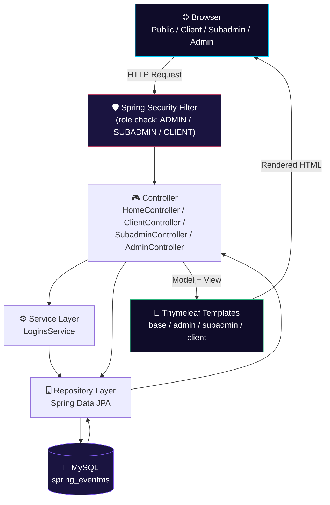

<div align="center">


<br/><br/>

<p>
  
  
  
  
  
</p>

<p>
  
  
  
</p>

<h3>🎉 A full-stack, role-based event booking & management platform built with Java and Spring Boot</h3>

</div>

---

## 📖 Overview

**EventMS** is a full-stack event booking and management web application built on **Java 17, Spring Boot 3.1, Spring Security, Spring Data JPA (Hibernate), Thymeleaf, and MySQL**. It runs three distinct portals from a single codebase — a public marketing/booking site, a **Client** self-service portal, and internal **Subadmin** and **Admin** dashboards — all protected by role-based Spring Security authorization.

Visitors can browse event categories, service packages, a photo gallery, and blog-style posts, then register and book a package. Clients manage their own bookings and payments; subadmins handle the operational side of assigned bookings; admins run the whole platform — categories, packages, content, users, and bookings end to end.

<table align="center">
<tr>
<td align="center">🏗️<br/><b>Architecture</b><br/>Spring MVC (Controller → Service/Repository → JPA)</td>
<td align="center">🔐<br/><b>Auth</b><br/>Spring Security + BCrypt, 3 role authorities</td>
<td align="center">🗄️<br/><b>Data Layer</b><br/>Spring Data JPA + Hibernate</td>
<td align="center">🎨<br/><b>UI Layer</b><br/>Thymeleaf + SB Admin 2 / Bootstrap</td>
</tr>
</table>

## ✨ Features

<table align="center" width="100%">
<tr>
<td width="33%" valign="top">

### 🌐 Public Site
- Home, About, Pricing pages
- Event categories & packages
- Package detail pages
- Photo gallery (lightbox)
- Blog-style event posts
- Contact-us form
- Client sign-up / login
- Forgot / reset password

</td>
<td width="33%" valign="top">

### 👤 Client Portal
- Client dashboard
- Create a new booking
- View & track bookings
- Booking payments
- Edit profile
- Change password

</td>
<td width="33%" valign="top">

### 🛠️ Subadmin & Admin
- Subadmin: assigned bookings, view booking, profile
- Admin: dashboard & task calendar
- Manage categories & features
- Manage packages (add/edit)
- Manage blog events (add/edit)
- Manage gallery photos
- Manage bookings & process booking status
- Manage users, clients & contact-us leads

</td>
</tr>
</table>

> 🔑 Access is enforced by **Spring Security authorities** — `/admin/**` requires `ADMIN`, `/subadmin/**` requires `SUBADMIN`, `/client/**` requires `CLIENT`, each backed by BCrypt-hashed credentials.

## 🛠️ Technology Stack

<div align="center">


</div>

**Backend:** Java 17 · Spring Boot 3.1 · Spring MVC · Spring Security · Spring Data JPA · Lombok
**Frontend:** Thymeleaf · Bootstrap 4 · SB Admin 2 · jQuery · DataTables · Lightbox · Font Awesome
**Database & Build:** MySQL · Maven · Git

## 🏗️ Architecture & Workflow



**Request flow:** every request first passes through the **Spring Security filter chain**, which checks the URL prefix against the caller's granted authority. Controllers delegate to the service/repository layer, JPA/Hibernate talks to MySQL, and Thymeleaf renders the role-appropriate template (`templates/admin/*`, `templates/subadmin/*`, `templates/client/*`, or the public templates).

## 🚀 Installation & Setup

### 1️⃣ Clone the Repository
```bash
git clone https://github.com/YOUR_USERNAME/EventMS.git
```

### 2️⃣ Navigate to the Project
```bash
cd EventMS
```

### 3️⃣ Configure the Database
Create a MySQL database named `spring_eventms` (or your own name) and update:
```
src/main/resources/application.properties
```

```properties
spring.datasource.driverClassName=com.mysql.cj.jdbc.Driver
spring.datasource.url=jdbc:mysql://localhost:3306/spring_eventms
spring.datasource.username=YOUR_DB_USERNAME
spring.datasource.password=YOUR_DB_PASSWORD

spring.main.allow-bean-definition-overriding=true
```

### 4️⃣ Build the Project
```bash
mvn clean install
```

### 5️⃣ Run the Application
```bash
mvn spring-boot:run
```
or, using the bundled Maven wrapper:
```bash
./mvnw spring-boot:run
```

### 6️⃣ Open the Application
```
http://localhost:8080
```

> 👤 Login as **Client** at `/home/client-login`, as **Admin** at `/home/admin-login`. Create your first accounts directly in the database or through the sign-up flow, since no default credentials ship with the project.

## 📂 Project Structure

```
EventMS/
├── src/
│   ├── main/
│   │   ├── java/com/project/eventms/
│   │   │   ├── config/                 → SpringSecurity.java
│   │   │   ├── controller/             → HomeController, ClientController,
│   │   │   │                             SubadminController, AdminController,
│   │   │   │                             ImageController
│   │   │   ├── entity/                 → Booking, Bookingevents, Bookingpayments,
│   │   │   │                             Category, Subcategories, Client, Users,
│   │   │   │                             Gallery, Post, Features, Guest,
│   │   │   │                             City, State, Calendar, Contactus, Cardcheck
│   │   │   ├── repository/             → Spring Data JPA repositories (1 per entity)
│   │   │   ├── security/               → CustomLoginsDetailsService, userService
│   │   │   ├── service/                → LoginsService (+ impl)
│   │   │   ├── Bookingstatus.java      → Booked / Approved / Live / Completed / Rejected
│   │   │   ├── Eventstatus.java        → Planned / Live / Completed / Cancelled
│   │   │   ├── LoginTypes.java         → ADMIN / SUBADMIN / CLIENT
│   │   │   ├── CommonFuns.java
│   │   │   └── eventmsApplication.java → Spring Boot entry point
│   │   └── resources/
│   │       ├── templates/
│   │       │   ├── admin/              → dashboard, bookings, categories, packages,
│   │       │   │                          blogevents, users, client, photosview, etc.
│   │       │   ├── subadmin/           → dashboard, bookings, viewbooking, myprofile
│   │       │   ├── client/             → dashboard, bookings, bookingadd, myprofile
│   │       │   └── *.html              → index, about, gallery, pricing,
│   │       │                              packagedetails, posts, postdetails, contactus
│   │       ├── static/assets/          → css, js, images, calendar, lightbox, DESIGN
│   │       └── application.properties
│   └── test/
├── uploads/                            → runtime image storage (galleries, posts,
│                                          profileimgs, subcategories)
├── docs/screenshots/
├── pom.xml
├── mvnw / mvnw.cmd
└── README.md
```

## 🧩 Domain Model & Status Flows

<div align="center">

| Enum | Values |
|---|---|
| `LoginTypes` | `ADMIN` · `SUBADMIN` · `CLIENT` |
| `Eventstatus` | `Planned` → `Live` → `Completed` · `Cancelled` |
| `Bookingstatus` | `Rejected` · `Booked` → `Approved` → `Live` → `Completed` |

</div>

Core entities: `Booking`, `Bookingevents`, `Bookingpayments`, `Category`, `Subcategories`, `Subcategoryfeatures`, `Features`, `Gallery`, `Post`, `Client`, `Users`, `Guest`, `City`, `State`, `Calendar`, `Contactus`, `Cardcheck`.

> ℹ️ **API Note:** EventMS is a server-rendered **Spring MVC + Thymeleaf** application (no separate REST API layer). `ImageController` streams uploaded images (galleries, posts, profile photos, subcategory images) back to the templates.

## 🎯 Learning Outcomes

☕ Java 17 & Spring Boot 3.1 &nbsp;•&nbsp; 🎮 Spring MVC (multi-role controllers) &nbsp;•&nbsp; 🛡️ Spring Security + BCrypt &nbsp;•&nbsp; 🗄️ Spring Data JPA across a 17-entity model &nbsp;•&nbsp; 🐬 MySQL design &nbsp;•&nbsp; 🎨 Thymeleaf across 4 layouts &nbsp;•&nbsp; ⚡ File upload/streaming &nbsp;•&nbsp; 📦 Maven Wrapper

## 🚀 Future Enhancements

<table align="center">
<tr>
<td>🔌 REST API Support</td>
<td>💳 Online Payment Gateway</td>
<td>📧 Email/SMS Notifications</td>
</tr>
<tr>
<td>📊 Booking Analytics Dashboard</td>
<td>📱 Mobile Application</td>
<td>☁️ Cloud Deployment</td>
</tr>
<tr>
<td>🎟️ QR Code Event Passes</td>
<td>🔑 OAuth2 / Social Login</td>
<td>🧪 Automated Test Coverage</td>
</tr>
</table>

## 🤝 Contributing

1. 🍴 Fork the repository
2. 🌿 Create a feature branch
3. 💾 Commit your changes
4. 📤 Push your branch
5. 🔁 Submit a Pull Request


## 🔗 Project Links

<div align="center">

<a href="https://github.com/YOUR_USERNAME/EventMS">
  
</a>
<a href="https://github.com/YOUR_USERNAME/EventMS/issues">
  
</a>
<a href="https://github.com/YOUR_USERNAME/EventMS/fork">
  
</a>

</div>

## 📄 License

This project is intended for **educational and learning purposes**. You are free to use, modify, and extend it for academic or personal projects.

> 📝 Replace this section with a formal license (e.g. MIT, Apache 2.0) and add a `LICENSE` file if you plan to distribute this project publicly. No `LICENSE` file currently exists in the repository.

## ⭐ Support

If you found this project useful, please give it a ⭐ **Star** on GitHub — it encourages future improvements and helps others discover the project.


