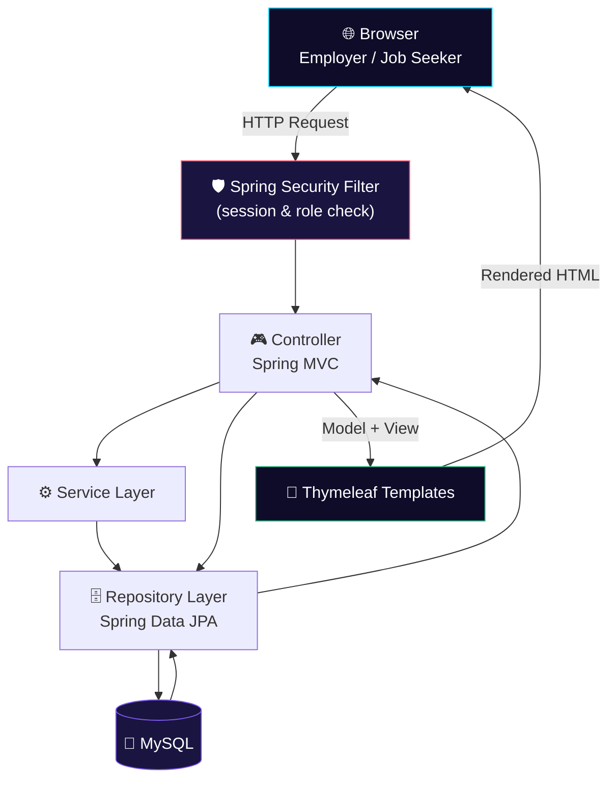

<div align="center">


<sub>🎬 Live animated banner — typewriter title reveal, radar pulses, scanning beam, and drifting particles, rendered with native SVG animation (no JS, no external CSS).</sub>

<br/><br/>

<p>
  
  
  
  
  
</p>

<p>
  
  
  
</p>

<h3>💼 A full-stack, role-based job portal connecting employers and job seekers — built with Java and Spring Boot</h3>

</div>


## 📖 Overview

**Job Portal** is a full-stack recruitment web application built on **Java, Spring Boot, Spring Security, Spring Data JPA (Hibernate), Thymeleaf, and MySQL**. It connects two sides of the hiring process from a single codebase — **employers** who post and manage job openings, and **job seekers** who search, apply, and track applications — all protected by Spring Security authentication.

Employers post roles, review applicants, and manage their listings end to end. Job seekers browse and search open positions, maintain a profile and resume, apply with one click, and follow their applications from a personal dashboard.

<table align="center">
<tr>
<td align="center">🏗️<br/><b>Architecture</b><br/>Spring MVC (Controller → Service/Repository → JPA)</td>
<td align="center">🔐<br/><b>Auth</b><br/>Spring Security, role-based sessions</td>
<td align="center">🗄️<br/><b>Data Layer</b><br/>Spring Data JPA + Hibernate</td>
<td align="center">🎨<br/><b>UI Layer</b><br/>Thymeleaf + HTML5/CSS3/JS</td>
</tr>
</table>


## ✨ Features

<table align="center" width="100%">
<tr>
<td width="50%" valign="top">

### 🏢 Employer Side
- Employer registration & login
- Post new job openings
- Edit / manage existing listings
- Review applicants per posting
- Employer dashboard

</td>
<td width="50%" valign="top">

### 👤 Job Seeker Side
- Job seeker registration & login
- Search & browse open jobs
- One-click apply flow
- Profile & resume management
- Application tracking dashboard

</td>
</tr>
</table>

> 🔑 Access is enforced by **Spring Security** — authenticated sessions gate posting, applying, and dashboard routes by user role.


## 🛠️ Technology Stack

<div align="center">

**Backend**


**Frontend**


**Database & Build**


</div>


## 🏗️ Architecture & Workflow



**Request flow:** every request passes through the **Spring Security filter chain**, which checks the session against the requested route. Controllers delegate to the service/repository layer, JPA/Hibernate talks to MySQL, and Thymeleaf renders the appropriate employer or job-seeker template.


## 📸 Screenshots & Demo

> 🖼️ Add your actual screenshots to `docs/screenshots/` and update the filenames below. Placeholders are shown until real images are added.

<div align="center">
<table>
<tr>
<td align="center" width="50%">

<br/><b>Public Home Page</b>
</td>
<td align="center" width="50%">

<br/><b>Employer Dashboard</b>
</td>
</tr>
<tr>
<td align="center" width="50%">

<br/><b>Job Search</b>
</td>
<td align="center" width="50%">

<br/><b>Job Seeker Dashboard</b>
</td>
</tr>
</table>
</div>


## 🚀 Installation & Setup

### 1️⃣ Clone the Repository
```bash
git clone https://github.com/Nesara29/prajju.git
```

### 2️⃣ Navigate to the Project
```bash
cd prajju
```

### 3️⃣ Configure the Database
Create a MySQL database and update:
```
src/main/resources/application.properties
```

```properties
spring.datasource.driverClassName=com.mysql.cj.jdbc.Driver
spring.datasource.url=jdbc:mysql://localhost:3306/job_portal
spring.datasource.username=YOUR_DB_USERNAME
spring.datasource.password=YOUR_DB_PASSWORD
```

### 4️⃣ Build the Project
```bash
mvn clean install
```

### 5️⃣ Run the Application
```bash
mvn spring-boot:run
```
or, using the bundled Maven wrapper:
```bash
./mvnw spring-boot:run
```

### 6️⃣ Open the Application
```
http://localhost:8080
```


## 📂 Project Structure

```
JobPortal/
├── src/
│   ├── main/
│   │   ├── java/
│   │   ├── resources/
│   │   │   ├── templates/
│   │   │   ├── static/
│   │   │   └── application.properties
│   └── test/
├── assets/                  → README banners (this file's graphics)
│   ├── hero-banner.svg
│   ├── section-divider.svg
│   └── footer-banner.svg
├── docs/screenshots/
├── pom.xml
├── mvnw / mvnw.cmd
└── README.md
```


## 🎯 Learning Outcomes

This project demonstrates practical, hands-on experience with:

- ☕ Java & Spring Boot
- 🎮 Spring MVC
- 🛡️ Spring Security
- 🗄️ Spring Data JPA (Hibernate)
- 🐬 MySQL relational database design
- 🎨 Thymeleaf templating
- ⚡ CRUD operations end to end
- 📦 Maven project management


## 🚀 Future Enhancements

<table align="center">
<tr>
<td>📎 Resume Upload (PDF/DOC)</td>
<td>✉️ Email Notifications</td>
<td>🗓️ Interview Scheduling</td>
</tr>
<tr>
<td>🏢 Company Profiles</td>
<td>🎯 Job Recommendations</td>
<td>📊 Admin Analytics Dashboard</td>
</tr>
<tr>
<td>🔗 REST API Integration</td>
<td>🔑 JWT Authentication</td>
<td>☁️ Cloud Deployment (AWS/Azure)</td>
</tr>
</table>


## 🤝 Contributing

Contributions are welcome!

1. 🍴 Fork the repository
2. 🌿 Create a feature branch
3. 💾 Commit your changes
4. 📤 Push your branch
5. 🔁 Submit a Pull Request


## 👨‍💻 Developer

<div align="center">


| | |
|---|---|
| 🧑‍💻 **Name** | `YOUR_NAME` |
| 🎓 **Role** | `Full-Stack Developer` |
| 📧 **Email** | `YOUR_EMAIL@example.com` |
| 🐙 **GitHub** | https://github.com/Nesara29 |

</div>

## 🔗 Project Links

<div align="center">

<a href="https://github.com/Nesara29/prajju">
  
</a>
<a href="https://github.com/Nesara29/prajju/issues">
  
</a>
<a href="https://github.com/Nesara29/prajju/fork">
  
</a>

</div>


## 📄 License

This project is intended for **educational and learning purposes**. You are free to use, modify, and extend it for academic or personal projects.

> 📝 Replace this section with a formal license (e.g. MIT, Apache 2.0) and add a `LICENSE` file if you plan to distribute this project publicly.

## ⭐ Support

If you found this project useful, please give it a ⭐ **Star** on GitHub — it encourages future improvements and helps others discover the project.

<div align="center">

</div>
