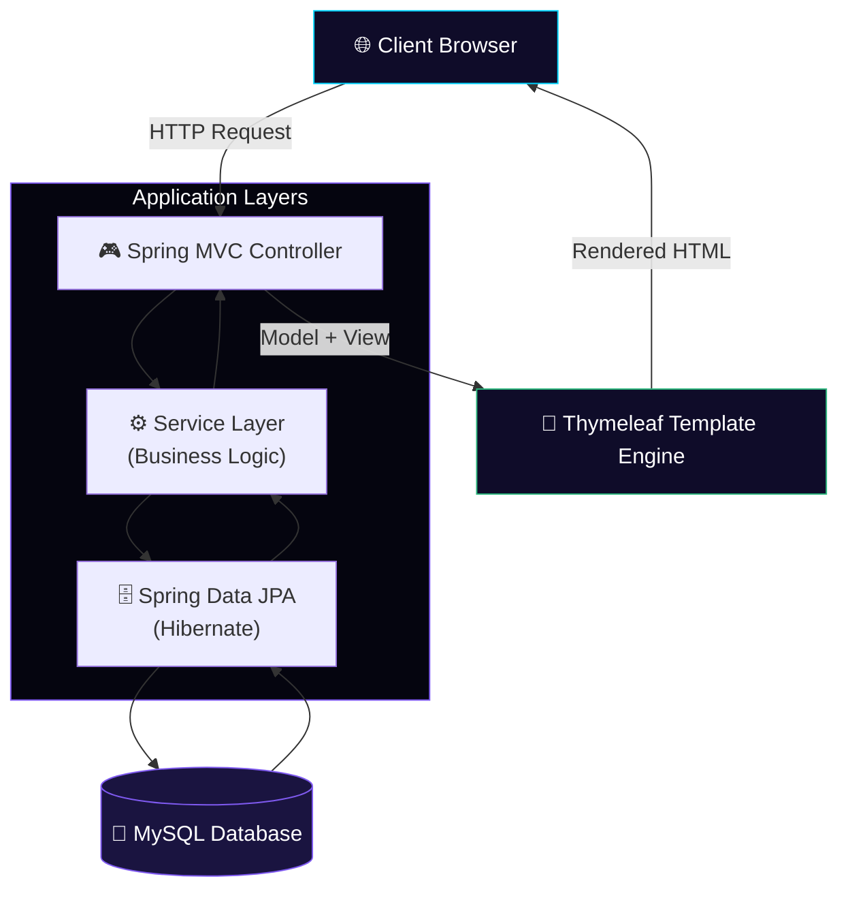

<div align="center">


<br/>

<!-- Badges -->
<p>
  
  
  
  
  
</p>

<p>
  
  
  
</p>

<h3>🎉 A full-stack Java + Spring Boot platform for planning, organizing, and managing events end-to-end</h3>

</div>


## 📖 Overview

**Event Management System (EMS)** is a web-based application built with **Java, Spring Boot, Spring MVC, Thymeleaf, Spring Data JPA, and MySQL**. It gives administrators an organized, intuitive platform to create events, manage participants, maintain schedules, and monitor registrations — all through a clean web interface.

This project follows the **MVC architecture** and demonstrates enterprise-style web application development using the Spring Boot ecosystem, making it a strong reference for anyone learning production-grade Java web development.

<table align="center">
<tr>
<td align="center">🎯<br/><b>Purpose</b><br/>Simplify event planning & management</td>
<td align="center">🏗️<br/><b>Architecture</b><br/>MVC (Model–View–Controller)</td>
<td align="center">🗄️<br/><b>Data Layer</b><br/>Spring Data JPA + Hibernate</td>
<td align="center">🎨<br/><b>UI Layer</b><br/>Thymeleaf + HTML5/CSS3</td>
</tr>
</table>


## ✨ Features

<table align="center" width="100%">
<tr>
<td width="33%" valign="top">

### 🎉 Event Management
- Event Creation & Management
- Update Event Information
- Delete Events
- Search & View Events

</td>
<td width="33%" valign="top">

### 👥 Participant & Registration
- Participant Registration
- Registration Management
- Event Scheduling

</td>
<td width="33%" valign="top">

### 🔐 Admin & Insights
- Administrator Dashboard
- Secure Authentication
- Event Reports
- Complete CRUD Operations

</td>
</tr>
</table>

> ⚡ Every module above is backed by a full **CRUD** implementation and a clean, MVC-driven request flow.


## 🛠️ Technology Stack

<div align="center">

**Backend**


**Frontend**


**Database**


**Build & Tools**


</div>


## 🏗️ Architecture & Workflow



> 📌 The application follows a classic **MVC request lifecycle**: the browser sends a request → the controller delegates to the service layer → JPA/Hibernate talks to MySQL → Thymeleaf renders the final HTML response.


## 📸 Screenshots & Demo

> 🖼️ Add your actual screenshots to `docs/screenshots/` and update the paths below. Placeholders are shown until real images are added.

<div align="center">
<table>
<tr>
<td align="center" width="50%">

<br/><b>Administrator Dashboard</b>
</td>
<td align="center" width="50%">

<br/><b>Event Management</b>
</td>
</tr>
<tr>
<td align="center" width="50%">

<br/><b>Participant Registration</b>
</td>
<td align="center" width="50%">

<br/><b>Event Reports</b>
</td>
</tr>
</table>
</div>


## 🚀 Installation & Setup

### 1️⃣ Clone the Repository
```bash
git clone https://github.com/YOUR_USERNAME/EMS.git
```

### 2️⃣ Navigate to the Project
```bash
cd EMS
```

### 3️⃣ Configure the Database
Create a MySQL database, then update the connection details in:
```
src/main/resources/application.properties
```

Example configuration:
```properties
spring.datasource.url=jdbc:mysql://localhost:3306/YOUR_DB_NAME
spring.datasource.username=YOUR_DB_USERNAME
spring.datasource.password=YOUR_DB_PASSWORD
spring.jpa.hibernate.ddl-auto=update
```

### 4️⃣ Build the Project
```bash
mvn clean install
```

### 5️⃣ Run the Application
```bash
mvn spring-boot:run
```
or
```bash
./mvnw spring-boot:run
```

### 6️⃣ Open the Application
```
http://localhost:8080
```


## 📂 Project Structure

```
EMS/
├── src/
│   ├── main/
│   │   ├── java/
│   │   ├── resources/
│   │   │   ├── templates/
│   │   │   ├── static/
│   │   │   └── application.properties
│   └── test/
├── assets/
│   ├── hero-banner.svg
│   ├── section-divider.svg
│   └── footer-banner.svg
├── docs/
│   └── screenshots/
├── pom.xml
├── mvnw
├── mvnw.cmd
└── README.md
```


## 🧩 Modules / Feature Areas

<div align="center">

| Module | Description |
|---|---|
| 🎉 Event Management | Create, update, search, view, and delete events |
| 👥 Participant Management | Register and manage event participants |
| 📝 Registration Management | Track and manage event registrations |
| 📅 Event Scheduling | Maintain event dates, times, and schedules |
| 👨‍💼 Dashboard | Central administrator control panel |
| 📊 Reports | View event and registration reports |
| 🔐 Authentication | Secure administrator login |

</div>

> ℹ️ **API Note:** EMS currently uses server-rendered **Spring MVC + Thymeleaf** views rather than a dedicated REST API. **REST API Support** is listed under Future Enhancements below for teams that want to expose EMS data to external clients or a mobile app.


## 🎯 Learning Outcomes

This project demonstrates practical, hands-on experience with:

- ☕ Java Programming
- 🌱 Spring Boot Development
- 🎮 Spring MVC
- 🗄️ Spring Data JPA (Hibernate)
- 🐬 MySQL Database Integration
- 🎨 Thymeleaf Templating
- ⚡ CRUD Operations
- 🏗️ MVC Architecture
- 📦 Maven Project Management


## 🚀 Future Enhancements

<table align="center">
<tr>
<td>🎟️ Online Ticket Booking</td>
<td>📱 QR Code Event Passes</td>
<td>📧 Email Notifications</td>
</tr>
<tr>
<td>💳 Payment Gateway Integration</td>
<td>📊 Event Analytics Dashboard</td>
<td>📱 Mobile Application</td>
</tr>
<tr>
<td>🔌 REST API Support</td>
<td>☁️ Cloud Deployment</td>
<td>🧑‍🤝‍🧑 Multi-User Role Management</td>
</tr>
</table>


## 🤝 Contributing

Contributions are welcome!

1. 🍴 Fork the repository
2. 🌿 Create a feature branch
3. 💾 Commit your changes
4. 📤 Push your branch
5. 🔁 Submit a Pull Request


## 👨‍💻 Developer

<div align="center">


| | |
|---|---|
| 🧑‍💻 **Name** | `YOUR_NAME` |
| 🎓 **Role** | `YOUR_ROLE` (e.g., Java / Full-Stack Developer) |
| 📧 **Email** | `YOUR_EMAIL@example.com` |
| 💼 **LinkedIn** | [YOUR_LINKEDIN_URL](https://linkedin.com/in/YOUR_LINKEDIN_USERNAME) |
| 🐙 **GitHub** | [@YOUR_GITHUB_USERNAME](https://github.com/YOUR_GITHUB_USERNAME) |
| 🌐 **Portfolio** | [YOUR_PORTFOLIO_URL](https://YOUR_PORTFOLIO_URL) |

</div>

## 🔗 Project Links

<div align="center">

<a href="https://github.com/YOUR_USERNAME/EMS">
  
</a>
<a href="https://github.com/YOUR_USERNAME/EMS/issues">
  
</a>
<a href="https://github.com/YOUR_USERNAME/EMS/fork">
  
</a>

</div>


## 📄 License

This project is intended for **educational and learning purposes**. You are free to use, modify, and extend it for academic or personal projects.

> 📝 Replace this section with a formal license (e.g. MIT, Apache 2.0) and add a `LICENSE` file if you plan to distribute this project publicly.

## ⭐ Support

If you found this project useful, please give it a ⭐ **Star** on GitHub — it encourages future improvements and helps others discover the project.

<div align="center">

</div>
